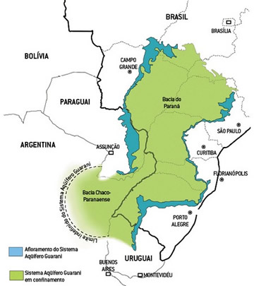

```{r include=FALSE}
knitr::opts_chunk$set(echo=FALSE, warning=FALSE, message=FALSE)
```

```{r}
library(tidyverse)
library(tmap)
library(plotly)
library(reshape2)
library(cagedExplorer)
source('geom_flat_violin.R')

# Custom map theme and settings
theme_set(custom_theme())
source('custom_map_settings.R')
```

O conteúdo dessa página é resultado de atividades desenvolvidas no âmbito do CEPER/FUNDACE e do Programa USP Municípios, sob coordenação do Prof. Rudinei Toneto Junior (FEA-RP/USP). Além de mim, também contribuíram com esse projeto: Francielly de Fátima Almeida, Cristiane Costa, Matheus Zanini e Thaina Raganicchi. Com exceção de Francielly, todos participamos na condição de bolsistas do Convênio USP-Santander.

Os dados e o código em linguagem R utilizados na análise apresentada a seguir estão disponíveis no meu [GitHub](https://github.com/andremenegatti/boletim-saneamento). A versão original do estudo, em formato PDF, pode ser obtida no site do [USP Municípios](https://municipios.usp.br/publicacoes/) ou no site da [FUNDACE](https://www.fundace.org.br/ceper/estudos).

# Panorama do Saneamento Básico no Estado de São Paulo 

Este boletim apresenta um breve panorama dos serviços saneamento básico prestados aos municípios do Estado de São Paulo. O objetivo é descrever alguns aspectos do fornecimento de água, bem como dos serviços de coleta e tratamento de esgoto, apresentando indicadores relativos aos níveis de atendimento, tarifas, desempenho financeiro, investimentos, entre outros. Além disso, busca-se analisar a distribuição dos diferentes arranjos jurídicos para prestação desses serviços no Estado de São Paulo.

Os dados apresentados referem-se ao ano de 2018 e foram obtidos a partir do Sistema Nacional de Informações Sobre Saneamento ([SNIS](http://www.snis.gov.br/)). Criado em 1996, o SNIS é o maior e mais importante sistema de informações do setor de saneamento do Brasil. No que se refere a dados de água e esgoto, as informações disponíveis são fornecidas pelas instituições responsáveis pela prestação dos serviços, tais como autarquias, departamentos municipais, companhias estaduais e empresas públicas e privadas.

# Distribuição Geográfica dos Tipos de Prestadores de Serviços

A Figura 1, a seguir, apresenta a distribuição geográfica dos tipos de empresa que fornecem água aos municípios paulistas. Nota-se que a maioria dos municípios é atendida por sociedades de economia mista, sobretudo na região sul do estado. Também é possível observar, no noroeste do estado, a predominância de municípios atendidos pela administração pública, direta ou indireta.

```{r, include=FALSE}
# Loading and filtering dataset -----------------------------------------------
snis <- readRDS('data/snis-2018-clean.rds')

snis_agua <- snis %>% 
  filter(!(municipio_clean %in% 
             c('MAUA', 'SALTO', 'SANTA MARIA DA SERRA') &
        tipo_servico == 'Esgotos'))

snis_esgoto <- snis %>% 
  filter(!(municipio_clean %in% 
             c('MAUA', 'SALTO', 'SANTA MARIA DA SERRA') &
             tipo_servico == 'Água'))
```

```{r fig.cap='Figura 1: Mapa da natureza jurídica dos fornecedores de água no Estado de São Paulo'}
# Mapa: tipo de prestador -----------------------------------------------------
mapa_agua_tipo <- snis_agua %>% 
  rename(`Tipo de prestador` = nat_jur_simplified) %>% 
  add_geometry_municipios() %>% 
  tm_shape() +
  tm_style("beaver") +
  tm_fill(
    'Tipo de prestador',
    palette = c('#fed976', '#fb6a4a', '#225ea8', '#bdbdbd'),
    alpha = 1,
    id = "municipio_clean"
    ) +
  custom_map_settings ; mapa_agua_tipo
```

Complementando o mapa acima, a Figura 2 traz informações do número de municípios atendidos por cada tipo de prestador. Nota-se que a SABESP é responsável por atender quase todos os municípios identificados em amarelo na Figura 1. De fato, dentre os 368 municípios em que o fornecimento de água fica a cargo de uma sociedade de economia mista, apenas 4 não são atendidos pela SABESP (Campinas, Guaratinguetá, Jundiaí e Nova Odessa). Dentre os prestadores que se enquadram na categoria mais ampla de “Administração Pública”, a maioria pertence à Administração Pública direta (i.e., os serviços são prestados diretamente pelas prefeituras), outros são autarquias (entidades relacionadas às prefeituras, mas com autonomia administrativa e financeira) e apenas um pequeno número organizam-se como empresas públicas. Por fim, vê-se que no Estado de São Paulo apenas um número reduzido de municípios era atendido por concessionárias privadas, no que diz respeito ao fornecimento de água.

Os dados relativos aos serviços de esgotamento são praticamente idênticos aos apresentados acima em relação ao fornecimento de água. Isso porque, nos municípios paulistas, uma mesma entidade é responsável tanto pelos serviços de coleta e tratamento de esgoto quanto pelo fornecimento de água, com a exceção de apenas três municípios (Mauá, Salto e Santa Maria da Serra).

```{r fig.cap='Figura 2: Número de municípios paulistas atendidos por cada tipo de fornecedor de água'}
# Data wrangling
snis_agua_barplot <- snis_agua %>% 
  mutate(natureza_juridica = 
           case_when(
             sigla_prestador == 'SABESP' ~ 'SABESP',
             str_detect(natureza_juridica, 'ista') ~ 'Outros',
             str_detect(natureza_juridica, 'direta') ~ 'Adm. pública direta',
             TRUE ~ natureza_juridica
             ) %>% fct_relevel(
               'SABESP',
               'Outros',
               'Adm. pública direta',
               'Autarquia',
               'Empresa pública',
               'Empresa privada',
               'Sem dados')
         )

# Plotting
barplot_tipo <- ggplot(snis_agua_barplot) +
  geom_bar(aes(x = nat_jur_simplified, fill = natureza_juridica),
           col = 'gray25') +
  scale_fill_manual(values = c('#fed976', '#ffffcc', '#fcbba1',
                               '#fb6a4a', '#a50f15',
                               '#225ea8', '#bdbdbd')) +
  scale_x_discrete(labels = c('Soc. de Econ. Mista', 'Adm. Pública',
                              'Empresa Privada', 'Sem Dados')) +
  scale_y_continuous(breaks = seq(0, 400, by = 50)) +
  theme(panel.grid = element_blank(),
        axis.text.x = element_text(angle = 45, hjust = 1),
        legend.title = element_blank(),
        plot.title = element_blank(),
        plot.subtitle = element_blank()) +
  labs(
    x = 'Tipo de prestador de serviços',
    y = 'Número de municípios'
  )

barplot_tipo
```

# Atendimento de água

A Figura 3 retrata um mapeamento dos municípios paulistas conforme índice de atendimento de água. Esse indicador é o percentual da população total atendida com abastecimento de água, em relação à população total residente no município. Nota-se que os menores índices se concentram mais ao sul do estado, onde verificou-se maior atuação da SABESP no fornecimento de água. Por outro lado, os índices de atendimento são maiores na região norte, onde grande parte dos prestadores pertence à Administração Pública municipal. Também é importante observar que as regiões norte e oeste do estado também são aquelas situadas sobre o Aquífero Guarani, conforme ilustrado na Figura 4. 

```{r fig.cap='Figura 3: Mapa do índice de atendimento de água no Estado de São Paulo'}
# Mapa: índice de atendimento -------------------------------------------------
mapa_atendimento_agua <- snis_agua %>% 
  add_geometry_municipios() %>% 
  rename(`Índice de atendimento` =
           in055_indice_de_atendimento_total_de_agua) %>% 
  tm_shape() +
  tm_style(
    "beaver",
    legend.format = list(fun = function(x) str_c(round(x), '%'),
                         text.separator = " a ")
    ) +
  tm_fill(
    'Índice de atendimento',
    palette = 'Blues',
    style = 'quantile',
    n = 6,
    alpha = 1,
    id = "municipio_clean",
    textNA = "Sem dados",
    colorNA = '#fff7bc'
    ) +
  custom_map_settings ; mapa_atendimento_agua
```

<center>



 <font size="1">Fonte: Scientific American Brasil, edição n. 47, abril de 2006</font>

</center>

Nas Figura 5 e 6, são apresentadas as distribuições dos índices municipais de atendimento. Na Figura 5, é possível observar que grande parte dos municípios paulistas tem elevados índices de atendimento, mas ainda há alguns – mais precisamente, dezoito - que atendem menos de 50% da população. Na Figura 6, por sua vez, as distribuições são segmentadas de acordo com o tipo de prestador de serviços. Vê-se que a mediana dos municípios atendidos por empresas privadas é próxima da mediana dos municípios atendidos pela Administração Pública Municipal. Nesse último caso, contudo, existe um grande número de municípios com 100% de atendimento, mas também há cidades com índice de atendimento inferior a 60%. Os piores resultados, contudo, estão no grupo de municípios atendidos pela SABESP, com a menor mediana e com os municípios com piores índices de atendimento. Dentre os 18 municípios com taxa de atendimento de água inferior a 50%, 16 são atendidos pela SABESP.

```{r fig.cap='Figura 5: Distribuição dos índices de atendimento de água dos municípios paulistas - Histograma'}
# Histograma: indice atendimento de agua --------------------------------------
hist_atend_agua <- ggplot(snis_agua) +
  geom_histogram(aes(x = in055_indice_de_atendimento_total_de_agua,
                     fill = nat_jur_simplified),
                 bins = 30) +
  theme(panel.grid = element_blank(),
        legend.title = element_blank(),
        legend.position = 'bottom',
        plot.title = element_blank(),
        plot.subtitle = element_blank()) +
  scale_fill_manual(values = c('#fed976', '#fb6a4a', '#225ea8')) +
  labs(
    x = 'Índice de atendimento total de água',
    y = 'Número de municípios'
    )

hist_atend_agua
```

```{r fig.cap='Figura 6: Distribuição dos índices de atendimento de água dos municípios paulistas - Boxplots'}
# Data wrangling
snis_boxplot_atendimento <- snis_agua %>% 
  filter(nat_jur_simplified != 'Sem dados') %>% 
  mutate(nat_jur_simplified = droplevels(nat_jur_simplified) %>% 
           fct_reorder(.x = in055_indice_de_atendimento_total_de_agua,
                       .fun = median, na.rm=TRUE))

summary_table_atendimento <- snis_boxplot_atendimento %>% 
  group_by(nat_jur_simplified) %>% 
  summarise(Mediana = median(in055_indice_de_atendimento_total_de_agua,
                             na.rm = TRUE)) %>% 
  mutate(Label = round(Mediana, 2) %>% str_replace('\\.', ','))

# Plotting
boxplot_atendimento_agua <- ggplot(snis_boxplot_atendimento) +
  geom_flat_violin(aes(x = nat_jur_simplified,
                       y = in055_indice_de_atendimento_total_de_agua,
                       fill = nat_jur_simplified),
                   alpha = 0.5) +
  geom_boxplot(aes(x = nat_jur_simplified,
                   y = in055_indice_de_atendimento_total_de_agua),
               width = 0.1, outlier.alpha = 0.3) +
  geom_text(data = summary_table_atendimento,
            aes(x = nat_jur_simplified,
                y = Mediana, label = Label),
            size = 3, nudge_x = 0.17, family = 'serif') +
  scale_x_discrete(labels = c('Adm. Pública',
                              'Soc. de Econ. Mista',
                              'Empresa Privada')) +
  scale_fill_manual(values = c('#fb6a4a', '#fed976', '#225ea8')) +
  theme(legend.position = 'none', panel.grid = element_blank(),
        axis.text.x = element_text(angle = 45, hjust = 1),
        plot.title = element_blank(),
        plot.subtitle = element_blank()) +
  labs(
    x = 'Tipo de prestador de serviços',
    y = 'Percentual da população atendida'
  )

boxplot_atendimento_agua
```

A Figura 7 apresenta a relação entre índice de atendimento de água e o PIB per capita dos municípios. As cores sinalizam o tipo dos prestadores de serviços, ao passo que o tamanho dos pontos é proporcional à população de cada município. A linha de regressão linear indica existir uma correlação positiva entre PIB per capita e índice de atendimento.

```{r fig.cap='Figura 7: Relação entre índice de atendimento de água e PIB per capita'}
snis_agua %>% 
  filter(nat_jur_simplified != 'Sem dados') %>% 
  mutate(nat_jur_simplified = droplevels(nat_jur_simplified)) %>% 
  ggplot(aes(x = pib_per_capita2017, y = in055_indice_de_atendimento_total_de_agua)) +
  geom_point(aes(size = pop, col = nat_jur_simplified),
             alpha = 0.4) +
  geom_smooth(method = 'lm', col = 'gray25',
              fill = 'lightgray', alpha = 0.5) +
  scale_x_log10(breaks = c(10, 30, 100, 300),
                labels = c('10 mil', '30 mil', '100 mil', '300 mil')) +
  coord_cartesian(ylim = c(20, 100)) +
  scale_color_manual(values = c('#fed976', '#fb6a4a', '#225ea8')) +
  labs(
    x = 'PIB per capita em reais (escala logarítmica)',
    y = 'Índice de atendimento',
    caption =
      'Fonte: dados de atendimento do SNIS (2018); dados de PIB e população do IBGE (2017).\nNota: o tamanho dos pontos é proporcional à população dos municípios.'
  ) +
  guides(size = FALSE) +
  theme(panel.grid = element_blank(), legend.title = element_blank(),
        legend.position = 'bottom')
```

# Tarifa de água

A Figura 8 apresenta o mapeamento dos municípios conforme a tarifa média do serviço de fornecimento de água cobrada por metro cúbico (m³). A distribuição varia de R\$0,14 à R\$5,70/m³. O mapa revela que as tarifas médias são mais elevadas na região sul do estado e na zona metropolitana de São Paulo, onde há maior atuação da SABESP no fornecimento de água e também onde se observam os menores índices de atendimento. Na região norte, situada sobre o Aquífero Guarani e onde predominam prestadores públicos, são praticadas as menores tarifas do estado. 

```{r fig.cap='Figura 8: Mapa das médias municipais de tarifa de fornecimento de água - Estado de São Paulo'}
mapa_tarifa_agua <- snis_agua %>% 
  add_geometry_municipios() %>% 
  rename(`Tarifa média (R$/m3)` =
           in005_tarifa_media_de_agua) %>% 
  tm_shape() +
  tm_style(
    "beaver",
    legend.format = 
      list(fun = function(x) formatC(x, digits = 2,
                                     big.mark = '.', decimal.mark = ','),
           text.separator = " a ")
    ) +
  tm_fill(
    'Tarifa média (R$/m3)',
    palette = 'Blues',
    style = 'quantile',
    n = 6,
    alpha = 1,
    id = "municipio_clean",
    textNA = "Sem dados",
    colorNA = '#fff7bc'
    ) +
  custom_map_settings ; mapa_tarifa_agua
```

A diferença entre níveis tarifários segundo o tipo de prestador de serviços também é visível na Figura 9, que apresenta as distribuições das tarifas médias municipais, segmentadas por tipo de prestador. O gráfico indica que a mediana da distribuição de tarifas dos municípios atendidos pela SABESP (e outras sociedades de economia mista) é maior do que a dos municípios atendidos por empresas privada, a qual, por sua vez, é maior do que a mediana dos municípios atendidos pela Administração Pública local. Entretanto, também se nota que alguns municípios deste último grupo possuem tarifas bastante elevadas. Adicionalmente, nos municípios em que o fornecimento de água é feito pela Administração Pública, as tarifas possuem uma maior dispersão quando comparadas às tarifas médias praticadas pela SABESP, caso em que se nota maior concentração ao redor da mediana (apesar da longa cauda de valores mais elevados). 

```{r fig.cap='Figura 9: Distribuição das médias municipais da tarifa de fornecimento de água - Municípios paulistas'}
# Data wrangling
snis_boxplot_tarifa <- snis_agua %>% 
  filter(nat_jur_simplified != 'Sem dados') %>% 
  mutate(nat_jur_simplified = droplevels(nat_jur_simplified) %>% 
           fct_reorder(.x = in005_tarifa_media_de_agua,
                       .fun = median, na.rm=TRUE))

summary_table_tarifa <- snis_boxplot_tarifa %>% 
  group_by(nat_jur_simplified) %>% 
  summarise(Mediana = median(in005_tarifa_media_de_agua,
                             na.rm = TRUE)) %>% 
  mutate(Label = round(Mediana, 2) %>% str_replace('\\.', ','))

# Plotting
boxplot_tarifa_agua <- ggplot(snis_boxplot_tarifa) +
  geom_flat_violin(aes(x = nat_jur_simplified,
                       y = in005_tarifa_media_de_agua,
                       fill = nat_jur_simplified),
                   alpha = 0.5) +
  geom_boxplot(aes(x = nat_jur_simplified,
                   y = in005_tarifa_media_de_agua),
               width = 0.1, outlier.alpha = 0.3) +
  geom_text(data = summary_table_tarifa,
            aes(x = nat_jur_simplified,
                y = Mediana, label = Label),
            size = 3, nudge_x = 0.17, family = 'serif') +
  scale_x_discrete(labels = c('Adm. Pública',
                              'Soc. de Econ. Mista',
                              'Empresa Privada')) +
  scale_fill_manual(values = c('#fb6a4a', '#fed976', '#225ea8')) +
  theme(legend.position = 'none', panel.grid = element_blank(),
        axis.text.x = element_text(angle = 45, hjust = 1)) +
  labs(
    x = 'Tipo de prestador de serviços',
    y = 'Tarifa média do fornecimento de água (R$/m3)'
  ) ; boxplot_tarifa_agua
```

A Figura 10 explora a relação entre a tarifa média de água e o PIB per capita dos municípios paulistas. Os gráficos indicam uma correlação positiva entre PIB per capita e tarifa média cobrada pelo fornecimento de água: municípios com maior PIB per capita tendem a cobrar tarifas mais elevadas. Essa relação é pouco ou nada evidente nos municípios atendidos por concessionárias privadas, é mais fraca nos municípios atendidos pela SABESP e bastante pronunciada nos municípios em que o fornecimento de água é feito pela própria Administração Pública local.

```{r fig.cap='Figura 10: Relação entre médias municipais da tarifa de água e PIB per capita, por tipo de prestador'}
# Scatterplot: tarifa vs. PIB per capita - single plot  -----------------------
scatterplot_tarifa_pib_per_capita_faceted <- snis_agua %>% 
  filter(nat_jur_simplified != 'Sem dados') %>% 
  mutate(nat_jur_simplified = droplevels(nat_jur_simplified)) %>% 
  ggplot(aes(x = pib_per_capita2017, y = in005_tarifa_media_de_agua)) +
  geom_point(aes(size = pop, col = nat_jur_simplified),
             alpha = 0.4) +
  geom_smooth(method = 'lm', col = 'gray25',
              fill = 'lightgray', alpha = 0.5, se = FALSE) +
  scale_x_log10(breaks = c(10, 30, 100, 300),
                labels = c('10 mil', '30 mil', '100 mil', '300 mil')) +
  scale_y_continuous(breaks = 0:6) +
  scale_color_manual(values = c('#fed976', '#fb6a4a', '#225ea8')) +
  labs(
    x = 'PIB per capita em reais (escala logarítmica)',
    y = 'Tarifa média de água',
    caption =
      'Fonte: dados tarifários do SNIS (2018); dados de PIB e população do IBGE (2017).\nNota: o tamanho dos pontos é proporcional à população dos municípios.'
  ) +
  guides(size = FALSE)  +
  theme(panel.grid = element_blank(), legend.position = 'bottom',
        legend.title = element_blank()) +
  facet_wrap(~ nat_jur_simplified, nrow = 1) +
  guides(size = FALSE, color = FALSE)

scatterplot_tarifa_pib_per_capita_faceted
```

# Coleta de esgoto

Na base de dados do SNIS, o índice de coleta de esgoto representa a razão, em termos percentuais, do volume de esgotos coletado sobre a o total de água consumido no município. A distribuição geográfica desse indicador no Estado de São Paulo é apresentada na Figura 11. Nota-se no mapa uma concentração de municípios com baixo índice de coleta de esgoto na região litorânea do Estado. Os valores desse indicador nos municípios paulistas vão de 18% a 100%, mas apenas 31 dos 645 municípios paulistas possuem índice de coleta inferior a 50%.

```{r fig.cap='Figura 11: Mapa dos índices municipais de coleta de esgoto - Estado de São Paulo'}
mapa_coleta_esgoto <- snis_esgoto %>% 
  add_geometry_municipios() %>% 
  rename(`Índice de coleta` =
           in015_indice_de_coleta_de_esgoto) %>% 
  tm_shape() +
  tm_style(
    "beaver",
    legend.format = list(fun = function(x) str_c(round(x), '%'),
                         text.separator = " a ")
  ) +
  tm_fill(
    'Índice de coleta',
    palette = 'Blues',
    style = 'quantile',
    n = 6,
    alpha = 1,
    id = "municipio_clean",
    textNA = "Sem dados",
    colorNA = '#fff7bc'
  ) +
  custom_map_settings ; mapa_coleta_esgoto
```

Nas Figuras 12 e 13, apresentam-se as distribuições dos índices municipais de coleta de esgoto. Na Figura 12, nota-se situação parecida com o que se verificou em relação ao índice de atendimento de água: grande parte dos municípios tem índices de coleta elevados, mas alguns ainda ficam abaixo da marca de 50%. Nota-se também que a maior parte dos municípios com índice de coleta de 100% é atendida pela SABESP (99 de um total de 131).

Na Figura 13, por sua vez, as distribuições são segmentadas de acordo com o tipo de prestador de serviços, sendo possível observar que a mediana é maior no grupo de municípios atendidos pela SABESP.

```{r fig.cap='Figura 12: Histograma dos índices municipais de coleta de esgoto - Estado de São Paulo'}
hist_coleta_esgoto <- ggplot(snis_esgoto) +
  geom_histogram(aes(x = in015_indice_de_coleta_de_esgoto,
                     fill = nat_jur_simplified),
                 bins = 30) +
  theme(panel.grid = element_blank(),
        legend.title = element_blank(),
        legend.position = 'bottom', 
        plot.title = element_blank(),
        plot.subtitle = element_blank()) +
  scale_fill_manual(values = c('#fed976', '#fb6a4a', '#225ea8')) +
  labs(
    x = 'Índice de coleta de esgoto',
    y = 'Número de municípios'
  )

hist_coleta_esgoto
```

```{r fig.cap='Figura 13: Distribuição dos índices municipais de coleta de esgoto, por tipo de prestador - Estado de São Paulo'}
snis_boxplot_coleta <- snis_esgoto %>% 
  filter(nat_jur_simplified != 'Sem dados') %>% 
  mutate(nat_jur_simplified = droplevels(nat_jur_simplified) %>% 
           fct_reorder(.x = in015_indice_de_coleta_de_esgoto,
                       .fun = median, na.rm=TRUE))

summary_table_coleta <- snis_boxplot_coleta %>% 
  group_by(nat_jur_simplified) %>% 
  summarise(Mediana = 
              median(in015_indice_de_coleta_de_esgoto,
                     na.rm = TRUE)
  ) %>% 
  mutate(Label = round(Mediana, 2) %>% str_replace('\\.', ','))

# Plotting
boxplot_coleta_esgoto <- ggplot(snis_boxplot_coleta) +
  geom_flat_violin(aes(x = nat_jur_simplified,
                       y = in015_indice_de_coleta_de_esgoto,
                       fill = nat_jur_simplified),
                   alpha = 0.5) +
  geom_boxplot(aes(x = nat_jur_simplified,
                   y = in015_indice_de_coleta_de_esgoto),
               width = 0.1, outlier.alpha = 0.3) +
  geom_text(data = summary_table_coleta,
            aes(x = nat_jur_simplified,
                y = Mediana, label = Label),
            size = 3, nudge_x = 0.17, family = 'serif') +
  scale_x_discrete(labels = c('Adm. Pública',
                              'Soc. de Econ. Mista',
                              'Empresa Privada')) +
  scale_fill_manual(values = c('#fb6a4a', '#fed976', '#225ea8')) +
  theme(legend.position = 'none', panel.grid = element_blank(),
        axis.text.x = element_text(angle = 45, hjust = 1),
        plot.title = element_blank(),
        plot.subtitle = element_blank()) +
  labs(
    x = 'Tipo de prestador de serviços',
    y = 'Índice de coleta de esgoto'
  ) ; boxplot_coleta_esgoto
```

# Tratamento de esgoto

A Figura 14 mostra a situação dos municípios paulistas quanto ao índice de tratamento de esgoto relativo ao consumo de água. Nesse índice, um valor de 100% significa que o volume tratado de esgoto com origem no município é igual ao volume de água ali consumido. Assim como na Figura 10 que representa a distribuição do serviço de coleta de esgoto, o mapa abaixo evidencia que os piores índices de tratamento se localizam na região litorânea do Estado. 

```{r fig.cap='Figura 14: Mapa dos índices municipais de tratamento de esgoto - Estado de São Paulo'}
mapa_tratamento_esgoto <- snis_esgoto %>% 
  add_geometry_municipios() %>% 
  rename(`Índice de tratamento` =
           in046_indice_de_esgoto_tratado_referido_à_agua_consumida) %>% 
  tm_shape() +
  tm_style(
    "beaver",
    legend.format = list(fun = function(x) str_c(round(x), '%'),
                         text.separator = " a ")
  ) +
  tm_fill(
    'Índice de tratamento',
    palette = 'Blues',
    style = 'quantile',
    n = 6,
    alpha = 1,
    id = "municipio_clean",
    textNA = "Sem dados",
    colorNA = '#fff7bc'
  ) +
  custom_map_settings ; mapa_tratamento_esgoto
```

O mapa é complementado pelas informações apresentadas nas Figura 15 e 16. Na Figura 15, nota-se que, apesar da maioria dos municípios possuir índices elevados, o esgoto de um número expressivo de municípios (33) ainda não é tratado. A Figura 16 evidencia, assim como verificado no caso de coleta de esgoto, que a mediana dos índices de tratamento também é mais elevada no grupo de municípios atendidos pela SABESP.

```{r fig.cap='Figura 15: Histograma dos índices municipais de tratamento de esgoto - Estado de São Paulo'}
hist_trat_esgoto <- ggplot(snis_esgoto) +
  geom_histogram(
    aes(x = in046_indice_de_esgoto_tratado_referido_à_agua_consumida,
        fill = nat_jur_simplified),
    bins = 30
    ) +
  theme(panel.grid = element_blank(),
        legend.title = element_blank(),
        legend.position = 'bottom',
        plot.title = element_blank(),
        plot.subtitle = element_blank()) +
  scale_fill_manual(values = c('#fed976', '#fb6a4a', '#225ea8')) +
  labs(
    x = 'Índice de tratamento de esgoto',
    y = 'Número de municípios'
  )

hist_trat_esgoto
```

```{r fig.cap='Figura 16: Distribuição dos índices municipais de tratamento de esgoto, por tipo de prestador - Estado de São Paulo'}
# Data wrangling
snis_boxplot_tratamento <- snis_esgoto %>% 
  filter(nat_jur_simplified != 'Sem dados') %>% 
  mutate(nat_jur_simplified = droplevels(nat_jur_simplified) %>% 
           fct_reorder(.x = in046_indice_de_esgoto_tratado_referido_à_agua_consumida,
                       .fun = median, na.rm=TRUE))

summary_table_tratamento <- snis_boxplot_tratamento %>% 
  group_by(nat_jur_simplified) %>% 
  summarise(Mediana = 
              median(in046_indice_de_esgoto_tratado_referido_à_agua_consumida,
                     na.rm = TRUE)
            ) %>% 
  mutate(Label = round(Mediana, 2) %>% str_replace('\\.', ','))

# Plotting
boxplot_tratamento_esgoto <- ggplot(snis_boxplot_tratamento) +
  geom_flat_violin(aes(x = nat_jur_simplified,
                       y = in046_indice_de_esgoto_tratado_referido_à_agua_consumida,
                       fill = nat_jur_simplified),
                   alpha = 0.5) +
  geom_boxplot(aes(x = nat_jur_simplified,
                   y = in046_indice_de_esgoto_tratado_referido_à_agua_consumida),
               width = 0.05, outlier.alpha = 0.3) +
  geom_text(data = summary_table_tratamento,
            aes(x = nat_jur_simplified,
                y = Mediana, label = Label),
            size = 3, nudge_x = 0.17, family = 'serif') +
  scale_x_discrete(labels = c('Adm. Pública',
                              'Soc. de Econ. Mista',
                              'Empresa Privada')) +
  scale_fill_manual(values = c('#fb6a4a', '#fed976', '#225ea8')) +
  theme(legend.position = 'none', panel.grid = element_blank(),
        axis.text.x = element_text(angle = 45, hjust = 1),
        plot.title = element_blank(),
        plot.subtitle = element_blank()) +
  labs(
    x = 'Tipo de prestador de serviços',
    y = 'Índice de tratamento de esgoto'
  ) ; boxplot_tratamento_esgoto

```

# Tarifa média do serviço de esgotamento sanitário

A Figura 17 ilustra a distribuição geográfica das tarifas médias, por metro cúbico, do serviço de esgotamento sanitário cobradas nos municípios paulistas. A distribuição varia de R\$0,00/m³ (Agudos e Marapoama) a R\$6,40/m³ (Campinas). Observa-se que as tarifas médias são mais elevadas nas regiões sul e litorânea do estado, bem como na região metropolitana de São Paulo. Não obstante, as Figuras 11 e 14 também indicam que os índices de coleta e tratamento nessas regiões estão entre os mais baixos do Estado. Além disso, como já mencionado, há grande presença da SABESP no que diz respeito aos serviços de esgotamento nessas nessa área.

```{r fig.cap='Figura 17: Mapa das médias municipais da tarifa de esgotamento sanitário - Estado de São Paulo'}
mapa_tarifa_esgoto <- snis_esgoto %>% 
  add_geometry_municipios() %>% 
  rename(`Tarifa média (R$/m3)` =
           in006_tarifa_media_de_esgoto) %>% 
  tm_shape() +
  tm_style(
    "beaver",
    legend.format = 
      list(fun = function(x) formatC(x, digits = 2,
                                     big.mark = '.', decimal.mark = ','),
           text.separator = " a ")
  ) +
  tm_fill(
    'Tarifa média (R$/m3)',
    palette = 'Blues',
    style = 'quantile',
    n = 7,
    alpha = 1,
    id = "municipio_clean",
    textNA = "Sem dados",
    colorNA = '#fff7bc'
  ) +
  custom_map_settings ; mapa_tarifa_esgoto
```

A Figura 18, por sua vez, apresenta as distribuições das tarifas médias cobradas nos municípios paulistas pelo serviço de esgotamento, segmentadas por tipo de prestador. Nota-se que os valores das tarifas médias nos municípios atendidos por sociedades de economia mista ou empresas privadas são mais próximos entre si (apesar de alguns casos atípicos, sobretudo dentre os municípios atendidos pela SABESP), ao passo que a distribuição das tarifas nos municípios atendidos pela Administração Pública municipal é mais dispersa, com mediana inferior.

```{r fig.cap='Figura 18: Distribuição das médias municipais da tarifa de esgotamento, por tipo de prestador - Estado de São Paulo'}
snis_boxplot_tarifa <- snis_esgoto %>% 
  filter(nat_jur_simplified != 'Sem dados') %>% 
  mutate(nat_jur_simplified = droplevels(nat_jur_simplified) %>% 
           fct_reorder(.x = in006_tarifa_media_de_esgoto,
                       .fun = median, na.rm=TRUE))

summary_table_tarifa <- snis_boxplot_tarifa %>% 
  group_by(nat_jur_simplified) %>% 
  summarise(Mediana = median(in006_tarifa_media_de_esgoto,
                             na.rm = TRUE)) %>% 
  mutate(Label = round(Mediana, 2) %>% str_replace('\\.', ','))

boxplot_tarifa_esgoto <- ggplot(snis_boxplot_tarifa) +
  geom_flat_violin(aes(x = nat_jur_simplified,
                       y = in006_tarifa_media_de_esgoto,
                       fill = nat_jur_simplified),
                   alpha = 0.5) +
  geom_boxplot(aes(x = nat_jur_simplified,
                   y = in006_tarifa_media_de_esgoto),
               width = 0.1, outlier.alpha = 0.3) +
  geom_text(data = summary_table_tarifa,
            aes(x = nat_jur_simplified,
                y = Mediana, label = Label),
            size = 3, nudge_x = 0.17, family = 'serif') +
  scale_x_discrete(labels = c('Adm. Pública',
                              'Soc. de Econ. Mista',
                              'Empresa Privada')) +
  scale_fill_manual(values = c('#fb6a4a', '#fed976', '#225ea8')) +
  theme(legend.position = 'none', panel.grid = element_blank(),
        axis.text.x = element_text(angle = 45, hjust = 1)) +
  labs(
    x = 'Tipo de prestador de serviços',
    y = 'Tarifa média do serviço de esgotamento (R$/m3)'
  ) ; boxplot_tarifa_esgoto
```

# Investimento

Em relação aos investimentos realizados pelos prestadores de serviços, o SNIS registra levantamento do valor do investimento realizado no ano de referência, diretamente ou por meio de contratos celebrados pelo próprio prestador de serviços, em equipamentos e instalações incorporados ao sistema de abastecimento de água. A Figura 19 classifica os municípios paulistas conforme faixa de investimento per capita na rede de água e esgoto, revelando que os maiores níveis de investimento estão nas regiões sul e metropolitana de São Paulo. Como visto, essas são as regiões com maior atendimento da SABESP e, em geral, registram maiores tarifas médias, menores níveis de atendimento de água, bem como menores índices de coleta e tratamento de esgoto. Essa constatação pode ser indício de atuação da SABESP no sentido de destinar maior volume de recursos às regiões com piores condições de saneamento, no intuito de melhorar a qualidade dos serviços.   

```{r fig.cap='Figura 19: Investimento per capita nas redes de água e esgoto nos municípios paulistas'}
# Data wrangling
snis_inv <- snis_agua %>% 
  rename(inv_prest = 
           fn033_investimentos_totais_realizados_pelo_prestador_de_servicos,
         inv_est = fn058_investimentos_totais_realizados_pelo_estado,
         inv_mun = fn048_investimentos_totais_realizados_pelo_municipio) %>% 
  mutate(na_inv_prest = is.na(inv_prest),
         na_inv_est = is.na(inv_est),
         na_inv_mun = is.na(inv_mun)) %>% 
  mutate_at(.vars = vars(inv_prest, inv_est, inv_mun),
            .funs = function(x) ifelse(is.na(x), 0, x)) %>% 
  mutate(inv_total = 
           ifelse(na_inv_prest & na_inv_est & na_inv_mun,
                  NA_real_,
                  inv_prest + inv_est + inv_mun)) %>% 
  mutate(`Inv. per capita (R$)` =
           inv_total / pop)

# Plotting
mapa_investimento_per_capita <- snis_inv %>% 
  add_geometry_municipios() %>% 
  tm_shape() +
  tm_style(
    "beaver",
    legend.format = 
      list(fun = function(x) formatC(x, big.mark = '.', decimal.mark = ','),
           text.separator = " a ")
  ) +
  tm_fill(
    'Inv. per capita (R$)',
    palette = c(RColorBrewer::brewer.pal(6, 'Blues')[-6], "#08306B"),
    style = 'fixed',
    breaks = c(0, 2, 15, 27, 43, 72, 400, 1357),
    alpha = 1,
    id = "municipio_clean",
    textNA = "Sem dados",
    colorNA = '#fff7bc'
  ) +
  custom_map_settings ; mapa_investimento_per_capita
```

Ainda no tocante a investimentos, a Figura 20 apresenta as distribuições dos níveis municipais de investimento per capita, por tipo de prestador de serviços, em escala logarítmica. Dentre os municípios atendidos pela Administração Pública, nota-se grande heterogeneidade nos níveis de investimento, ao passo que os valores tendem a ser mais centrados na média no grupo de municípios atendidos pela SABESP e outras sociedades de economia mista. 	Adicionalmente, observa-se que a média dos investimentos na rede de água e esgoto realizados pela inciativa privada é muito superior à média dos investimentos empreendidos pela administração pública. 

```{r fig.cap='Figura 20: Distribuição do investimento per capita nas redes de água a esgoto, por tipo de prestador - Municípios do Estado de São Paulo'}
# Data wrangling
snis_boxplot_inv <- snis_inv %>% 
  filter(nat_jur_simplified != 'Sem dados') %>% 
  mutate(nat_jur_simplified = droplevels(nat_jur_simplified) %>% 
           fct_reorder(.x = `Inv. per capita (R$)`,
                       .fun = median, na.rm=TRUE)) %>% 
  mutate(`Inv. per capita (R$)` = `Inv. per capita (R$)` + 0.01)

summary_table_inv <- snis_boxplot_inv %>% 
  group_by(nat_jur_simplified) %>% 
  summarise(Mediana = median(`Inv. per capita (R$)`,
                             na.rm = TRUE)) %>% 
  mutate(Label = round(Mediana, 2) %>% str_replace('\\.', ','))

# Plotting
boxplot_inv <- ggplot(snis_boxplot_inv) +
  geom_flat_violin(aes(x = nat_jur_simplified,
                       y = `Inv. per capita (R$)`,
                       fill = nat_jur_simplified),
                   alpha = 0.5) +
  geom_boxplot(aes(x = nat_jur_simplified,
                   y = `Inv. per capita (R$)`),
               width = 0.03, outlier.alpha = 0.3) +
  geom_text(data = summary_table_inv,
            aes(x = nat_jur_simplified,
                y = Mediana, label = Label),
            size = 3, nudge_x = 0.17, family = 'serif') +
  scale_x_discrete(labels = c('Adm. Pública',
                              'Soc. de Econ. Mista',
                              'Empresa Privada')) +
  scale_y_log10(breaks = c(0.01, 1, 2, 5, 30, 100, 500, 1000),
                labels = c(0, 1, 2, 5, 30 , 100, 500, 1000)) +
  scale_fill_manual(values = c('#fb6a4a', '#fed976', '#225ea8')) +
  theme(legend.position = 'none', panel.grid = element_blank(),
        axis.text.x = element_text(angle = 45, hjust = 1),
        plot.title = element_blank(), plot.subtitle = element_blank()) +
  labs(
    x = 'Tipo de prestador de serviços',
    y = 'Investimento per capita em R$ (escala log.)'
  ) ; boxplot_inv
```

# Indicador de desempenho financeiro

Em linhas gerais, o indicador de desempenho financeiro disponível no SNIS é um índice que reflete a razão entre o total de receitas e o total de despesas com os serviços de saneamento, em termos percentuais. Um índice de desempenho financeiro elevado indica que as receitas do prestador de serviços são bastante superiores a suas despesas.

A Figura 21 apresenta, na forma de mapa, os índices de desempenho financeiro dos prestadores de serviços de água e esgoto nos municípios paulistas. É possível notar que existem alguns grupos de municípios vizinhos com índices elevados de desempenho financeiro, tais como aqueles próximos a Lins e Novo Horizonte, Piracicaba e na região metropolitana de São Paulo. Por outro lado, o mapa também indica índices mais baixos no sul, no nordeste e no litoral do estado.

```{r fig.cap='Figura 21: Mapa do desempenho financeiro dos prestadores de serviços de saneamento no Estado de São Paulo'}
# Mapa: indicador de desempenho financeiro ------------------------------------
mapa_desempenho_financeiro <- snis_inv %>% 
  rename(`Ind. Desemp. Financeiro` =
           in012_indicador_de_desempenho_financeiro) %>% 
  add_geometry_municipios() %>% 
  tm_shape() +
  tm_style(
    "beaver",
    legend.format = 
      list(fun = function(x) round(x) %>% 
             str_replace('\\.', ','),
           text.separator = " a ")
    ) +
  tm_fill(
    'Ind. Desemp. Financeiro',
    palette = 'Blues',
    style = 'quantile',
    n = 6,
    alpha = 1,
    id = "municipio_clean",
    textNA = "Sem dados",
    colorNA = '#fff7bc'
    ) +
  custom_map_settings ; mapa_desempenho_financeiro
```

A Figura 22 ilustra a distribuição dos índices de desempenho financeiro, por tipo de prestador. Como nos demais gráficos semelhantes apresentados neste boletim, cada distribuição é composta por valores calculados no nível dos municípios (e não agregados por tipo de prestador). Assim, nota-se que, dentre os municípios atendidos por empresas privadas, a mediana do índice de desempenho é ligeiramente superior à mediana verificada no grupo de municípios atendidos pela administração pública local. Essa última, por sua vez, é ligeiramente superior à mediana dos municípios atendidos por sociedade de economia mista (SABESP e outras). Observa-se também que tanto os piores quanto os melhores resultados – em nível municipal – ocorrem em municípios atendidos pela administração pública local. 

```{r fig.cap='Figura 22: Distribuição do índice de desempenho financeiro - Prestadores de serviços de água e esgotamento sanitário nos municípios paulistas - Comparação entre tipos de prestadores'}
# Boxplot: desempenho financeiro ----------------------------------------------
# Data wrangling
snis_boxplot_desempenho <- snis_agua %>% 
  filter(nat_jur_simplified != 'Sem dados') %>% 
  mutate(nat_jur_simplified = droplevels(nat_jur_simplified) %>% 
           fct_reorder(.x = in012_indicador_de_desempenho_financeiro,
                       .fun = median, na.rm=TRUE))

summary_table_desempenho <- snis_boxplot_desempenho %>% 
  group_by(nat_jur_simplified) %>% 
  summarise(Mediana = median(in012_indicador_de_desempenho_financeiro,
                             na.rm = TRUE)) %>% 
  mutate(Label = round(Mediana, 2) %>% str_replace('\\.', ','))

# Plotting
boxplot_desempenho <- ggplot(snis_boxplot_desempenho) +
  geom_flat_violin(aes(x = nat_jur_simplified,
                       y = in012_indicador_de_desempenho_financeiro,
                       fill = nat_jur_simplified),
                   alpha = 0.5) +
  geom_boxplot(aes(x = nat_jur_simplified,
                   y = in012_indicador_de_desempenho_financeiro),
               width = 0.1, outlier.alpha = 0.3) +
  geom_text(data = summary_table_desempenho,
            aes(x = nat_jur_simplified,
                y = Mediana, label = Label),
            size = 3, nudge_x = 0.17, family = 'serif') +
  scale_x_discrete(labels = c('Soc. de Econ. Mista', 'Adm. Pública',
                              'Empresa Privada')) +
  scale_fill_manual(values = c('#fed976','#fb6a4a', '#225ea8')) +
  theme(legend.position = 'none', panel.grid = element_blank(),
        plot.title = element_blank(), plot.subtitle = element_blank(),
        axis.text.x = element_text(angle = 45, hjust = 1)) +
  labs(
    x = 'Tipo de prestador de serviços',
    y = 'Índice de desempenho financeiro'
  ) ; boxplot_desempenho
```

# Índice de perdas

As Figuras 23 e 24 abaixo trazem informações sobre a situação dos municípios paulistas em relação ao índice de perdas de faturamento de água. Em suma, este índice avalia em termos percentuais o quanto da água produzida pelo sistema de abastecimento não foi faturada pelo prestador de serviços, sendo assim uma medida de perdas de recurso hídrico no processo de abastecimento de água.  As perdas trazem vários impactos negativos, seja à sociedade, ao meio ambiente, à receita das empresas bem como aos investimentos necessários para melhorias no acesso ao saneamento. O mapa na Figura 23 mostra que os maiores índices de perdas se concentram mais ao leste do estado paulista.

```{r fig.cap='Figura 23: Mapa do índice de perdas de faturamento dos prestadores de serviço de abastecimento de água no Estado de São Paulo'}
mapa_perdas <- snis_agua %>% 
  add_geometry_municipios() %>% 
  rename(`Índice de perdas` =
           in013_indice_de_perdas_faturamento) %>% 
  tm_shape() +
  tm_style(
    "beaver",
    legend.format = 
      list(fun = function(x) formatC(round(x, 1),
                                     big.mark = '.', decimal.mark = ','),
           text.separator = " a ")
  ) +
  tm_fill(
    'Índice de perdas',
    palette = 'Blues',
    style = 'quantile',
    n = 6,
    alpha = 1,
    id = "municipio_clean",
    textNA = "Sem dados",
    colorNA = '#fff7bc'
  ) +
  custom_map_settings ; mapa_perdas
```

Na Figura 24, observa-se que a mediana do índice de perdas é maior para os municípios em que o prestador de serviços é de administração pública. Adicionalmente verifica-se que, para este tipo de prestador, há maior dispersão nos índices municipais. Por sua vez, os municípios atendidos por sociedade de economia mista (SABESP e outras) foram os que apresentaram a menor mediana dos índices de perda calculados no nível dos municípios. 

```{r fig.cap='Figura 24: Distribuição dos índices municipais de perdas de faturamento no abastecimento de água, por tipo de prestador - Estado de São Paulo'}
# Boxplot perdas --------------------------------------------------------------
snis_boxplot_perdas <- snis_agua %>% 
  filter(nat_jur_simplified != 'Sem dados') %>% 
  mutate(nat_jur_simplified = droplevels(nat_jur_simplified) %>% 
           fct_reorder(.x = in013_indice_de_perdas_faturamento,
                       .fun = median, na.rm = TRUE))

summary_table_perdas <- snis_boxplot_perdas %>% 
  group_by(nat_jur_simplified) %>% 
  summarise(Mediana = median(in013_indice_de_perdas_faturamento,
                             na.rm = TRUE)) %>% 
  mutate(Label = round(Mediana, 2) %>% str_replace('\\.', ','))

# Plotting
boxplot_perdas <- ggplot(snis_boxplot_perdas) +
  geom_flat_violin(aes(x = nat_jur_simplified,
                       y = in013_indice_de_perdas_faturamento,
                       fill = nat_jur_simplified),
                   alpha = 0.5) +
  geom_boxplot(aes(x = nat_jur_simplified,
                   y = in013_indice_de_perdas_faturamento),
               width = 0.1, outlier.alpha = 0.3) +
  geom_text(data = summary_table_perdas,
            aes(x = nat_jur_simplified,
                y = Mediana, label = Label),
            size = 3, nudge_x = 0.17, family = 'serif') +
  scale_x_discrete(labels = c('Soc. de Econ. Mista',
                              'Empresa Privada',
                              'Adm. Pública')) +
  scale_fill_manual(values = c('#fed976', '#225ea8', '#fb6a4a')) +
  theme(legend.position = 'none', panel.grid = element_blank(),
        axis.text.x = element_text(angle = 45, hjust = 1),
        plot.title = element_blank(), plot.subtitle = element_blank()) +
  labs(
    x = 'Tipo de prestador de serviços',
    y = 'Índice de perdas (faturamento)'
  ) ; boxplot_perdas
```

# Correlação entre indicadores	

A Figura 25 abaixo traz cruzamentos entre os diferentes indicadores analisados anteriormente, de forma a verificar as relações de correlação entre eles. Nota-se que o tratamento de esgoto se correlaciona positivamente, de forma mais forte, com a coleta de esgoto e vice-versa, sendo também correlacionado positivamente com consumo de água per capita e as tarifas médias de água e esgoto, ou seja, nessa análise simples de correlação, a cobrança de maiores tarifas está associada com um melhor tratamento de esgoto. Por outro lado, o indicador de tratamento de esgoto se correlaciona negativamente com o atendimento de água, com o indicador de desempenho financeiro e com índice de perdas.

```{r fig.cap='Figura 25: Matriz de correlação entre indicadores de água e esgoto - Municípios paulistas'}
library(reshape2)

rm(list = ls())

# Loading and filtering dataset -----------------------------------------------
snis <- readRDS('data/snis-2018-clean.rds')

snis_agua <- snis %>% 
  filter(!(municipio_clean %in% 
             c('MAUA', 'SALTO', 'SANTA MARIA DA SERRA') &
             tipo_servico == 'Esgotos'))

snis_esgoto <- snis %>% 
  filter(!(municipio_clean %in% 
             c('MAUA', 'SALTO', 'SANTA MARIA DA SERRA') &
             tipo_servico == 'Água'))

# Custom map theme and settings -----------------------------------------------
# theme_set(custom_theme())

# Subsetting: only relevant columns, with shorter names -----------------------
# Water and 'overall' features
snis_subset_agua <- snis_agua %>% 
  select(municipio_clean,
         tarifa_media_agua = in005_tarifa_media_de_agua,
         perdas_agua = in013_indice_de_perdas_faturamento,
         atendimento_agua = in055_indice_de_atendimento_total_de_agua,
         consumo_medio_per_capita_agua = in022_consumo_medio_percapita_de_agua,
         investimento_per_capita = inv_per_capita,
         desempenho_financeiro = in012_indicador_de_desempenho_financeiro
  )

# Sewage-related features
snis_subset_esgoto <- snis_esgoto %>% 
  select(municipio_clean,
         tarifa_media_esgoto = in006_tarifa_media_de_esgoto,
         coleta_esgoto = in015_indice_de_coleta_de_esgoto,
         tratamento_esgoto = in016_indice_de_tratamento_de_esgoto,
  )

# Concatenating partial datasets
snis_subset <- snis_subset_agua %>% 
  left_join(snis_subset_esgoto, by = 'municipio_clean')

# Computing the correlation matrix --------------------------------------------
corr_matrix <- snis_subset %>% 
  select(-municipio_clean) %>% 
  drop_na() %>% 
  cor() %>% 
  round(2)

# Function to reorder matrix based on clustering
reorder_cormat <- function(cormat){
  # Use correlation between variables as distance
  dd <- as.dist((1 - cormat) / 2)
  hc <- hclust(dd)
  cormat <- cormat[hc$order, hc$order]
}

# Reordering for a more informative plot
corr_matrix = reorder_cormat(corr_matrix)

# Melting
melted_cormat <- melt(corr_matrix, na.rm=TRUE)

# Function for redefining factor labels for better text on plot labels
pretty_labels <- function(x) {
  str_replace(x, 'investimento_per_capita', 'Invest. per capita') %>% 
    str_replace('tarifa_media_esgoto', 'Tarifa média (esgoto)') %>% 
    str_replace('tarifa_media$', 'Tarifa média (total)') %>% 
    str_replace('tarifa_media_agua', 'Tarifa média (água)') %>% 
    str_replace('coleta_esgoto', 'Coleta de esgoto') %>% 
    str_replace('tratamento_esgoto', 'Trat. de esgoto') %>% 
    str_replace('consumo_medio_per_capita_agua', 'Cons. de água per capita') %>% 
    str_replace('atendimento_agua' ,'Atend. de água') %>% 
    str_replace('desempenho_financeiro', 'Desemp. financeiro') %>% 
    str_replace('perdas_agua', 'Perdas (faturamento)')
}

# Redefining factor labels for pretty names
melted_cormat_pretty <- melted_cormat %>% 
  mutate(Var1 = fct_relabel(Var1, .fun = ~pretty_labels(.)),
         Var2 = fct_relabel(Var2, .fun = ~pretty_labels(.)))

# Plotting
corr_plot <- 
  ggplot(data = melted_cormat_pretty,
       aes(x = Var2, y = Var1, fill = value)) +
  geom_tile(color = 'white') +
  geom_text(
    aes(x = Var2, y = Var1,
        label = formatC(value, big.mark = '.', decimal.mark = ',')),
    color = "gray10", size = 3.25, family = 'serif'
    ) +
  geom_text(
    data = melted_cormat_pretty %>% filter(value > .8),
    aes(x = Var2, y = Var1,
        label = formatC(value, big.mark = '.', decimal.mark = ',')),
    color = "gray90", size = 3.25, family = 'serif'
  ) +
  scale_fill_gradient2(
    high = '#053061', low  = '#67000d', #'#b2182b',
    mid = 'white',
    midpoint = 0, limit = c(-1, 1), space = 'Lab',
    name = "Coeficiente\nde correlação",
    label = function(x) formatC(x, big.mark = '.', decimal.mark = ',')
  ) +
  coord_fixed() +
  theme_minimal() +
  theme(
    text = element_text(family = 'serif'),
    axis.title = element_blank(),
    axis.text = element_text(size = 11),
    panel.grid.major = element_blank(),
    panel.border = element_blank(),
    panel.background = element_blank(),
    axis.ticks = element_blank(),
    axis.text.x = element_text(angle = 45, vjust = 1, hjust = 1),
    panel.grid = element_blank(),
    legend.position = 'top',
    legend.direction = 'horizontal'
    ) +
  guides(fill = guide_colorbar(
    barwidth = 7, barheight = 1,
    title.position = 'top', title.hjust = 0.5
    )) ; corr_plot

```

As tarifas médias de água e esgoto apresentam grande correlação positiva entre si. Ambas as tarifas também apresentam correlação positiva com investimento per capita. Isso indica que nos municípios em que há maiores tarifas, o nível de investimento per capita tende a ser maior. No entanto, o investimento apresenta correlação negativa com indicadores que permitem avaliar a situação dos municípios em relação ao saneamento, como atendimento de água, tratamento e coleta de esgoto, ou seja, municípios com os maiores níveis de investimento seriam aqueles com os piores indicadores de acesso ao saneamento básico. Essa constatação faz sentido ao se observar que os municípios com maiores carências em termos de acesso ao saneamento prescindem de maiores investimentos nas redes de água e esgoto. O investimento per capita também se correlaciona negativamente com o consumo de água per capita, com o índice de perdas e com o indicador de desempenho financeiro. 

O consumo de água, por sua vez, tende a ser maior quanto maiores o atendimento de água e os indicadores de desempenho financeiro e de perdas de faturamento de água, além do melhor indicador de tratamento de esgoto como já mencionado anteriormente.

Além das relações já destacadas, os indicadores de perdas e de desempenho financeiro apresentam correlação positiva entre si, bem como com o indicador de atendimento de água. 

Por fim, também se observa que o atendimento de água se correlaciona negativamente com as tarifas médias de água e esgoto, o que indica que a cobrança de maiores tarifas está associada à uma menor taxa de atendimento de água.

# Ranking dos municípios paulistas

Por fim, foi feito um ranking dos municípios paulistas através do cálculo de uma nota final média para cada município que leva em conta os indicadores de atendimento de água, taxa de tratamento de esgoto, investimento per capita em saneamento básico (água e esgoto), índice de perdas de faturamento de água, indicador de desempenho financeiro, tarifa de água e tarifa de esgoto, todos padronizados com nota de 0 a 100.  Tarifas e índices de perdas foram normalizados de forma que o maior valor recebeu nota 0 e o menor valor, nota 100. O indicador de desempenho financeiro e os investimentos foram normalizados de forma que para os menores valores foi atribuída nota 0 e, para os maiores, nota 100. Foram considerados os dados dos 594 municípios paulistas (de um total de 645) para os quais havia dados completos relativos ao ano de 2018.

As Figuras 26 e 27, a seguir reportam a situação dos municípios paulistas em relação à pontuação final média. No mapeamento dos municípios, conforme apresentado na Figura 26, nota-se que as piores pontuações estão concentradas na região sul do estado, enquanto as melhores estão nas regiões norte e noroeste. 

```{r include=FALSE}
# Loading and filtering dataset -----------------------------------------------
snis_esgoto <- readRDS('data/snis-esgoto.rds')
snis_agua <- readRDS('data/snis-agua.rds')

snis <- snis_agua %>% 
  select(municipio, municipio_clean, regiao_governo, regiao_administrativa,
         pib2017,
         pib_per_capita2017,
         tipo_prestador = nat_jur_simplified,
         populacao = pop2017, inv_per_capita,
         tarifa_agua = in004_tarifa_media_praticada,
         desempenho = in012_indicador_de_desempenho_financeiro,
         perdas = in013_indice_de_perdas_faturamento,
         consumo_agua = in022_consumo_medio_percapita_de_agua,
         atendimento = in055_indice_de_atendimento_total_de_agua) %>% 
  inner_join(
    snis_esgoto %>% 
      select(
        municipio_clean, Codmun7,
        tarifa_esgoto = in006_tarifa_media_de_esgoto,
        coleta = in015_indice_de_coleta_de_esgoto,
        tratamento = in046_indice_de_esgoto_tratado_referido_à_agua_consumida
        ),
    by = 'municipio_clean'
    )

# Function to normalize variables
minmax_norm <- function(x, reverse = FALSE,
                        scale_to_100 = TRUE) {
  if (reverse) numerator <- max(x) - x
  if (!reverse) numerator <- x - min(x)
  denominator <- max(x) - min(x)
  x_norm <- numerator / denominator
  if (scale_to_100) x_norm <-  x_norm * 100
  x_norm
}

# Computing overall score
snis_ranking <- snis %>% 
  drop_na() %>% 
  select(-municipio_clean) %>% 
  mutate(perdas = ifelse(perdas > 0, perdas, 0)) %>% # <----
  mutate(sqrt_inv_per_capita = sqrt(inv_per_capita)) %>% 
  mutate(
    tarifa_agua_norm = minmax_norm(tarifa_agua, reverse = TRUE),
    tarifa_esgoto_norm = minmax_norm(tarifa_esgoto, reverse = TRUE),
    inv_per_capita_norm = minmax_norm(inv_per_capita),
    sqrt_inv_per_capita_norm = minmax_norm(sqrt_inv_per_capita),
    perdas_norm = minmax_norm(perdas, reverse = TRUE),
    desempenho_norm = minmax_norm(desempenho),
    # Score as average of normalized indicators
    score = (atendimento + coleta + tratamento +
              tarifa_agua_norm + tarifa_esgoto_norm +
              sqrt_inv_per_capita_norm + perdas_norm +
               desempenho_norm) / 8
) %>% 
  mutate(ranking = dense_rank(desc(score))) %>% 
  arrange(ranking)
```

```{r fig.cap='Figura 26: Mapa da pontuação média final dos municípios paulistas'}
source('custom_map_settings.R')

# Plotting map
mapa_ranking <- municipios_sp %>% 
  select(Codmun7) %>% 
  left_join(snis_ranking, by = 'Codmun7') %>% 
  add_geometry_municipios() %>% 
  rename(`Pontuação` = score) %>% 
  tm_shape() +
  tm_style(
    "beaver",
    legend.format = 
      list(fun = function(x) formatC(round(x),
                                     big.mark = '.',
                                     decimal.mark = ','),
           text.separator = " a ")
  ) +
  tm_fill(
    'Pontuação',
    palette = 'Blues',
    style = 'quantile',
    n = 5,
    alpha = 1,
    id = "municipio",
    textNA = "Sem dados",
    colorNA = '#fff7bc'
  ) +
  custom_map_settings ; mapa_ranking
```

A Figura 27 apresenta a distribuição das notas dos municípios considerando o tipo de prestador de serviços. Nota-se que as melhores notas foram registradas em municípios cujo abastecimento é fornecido pela administração pública. No entanto, também se verificam municípios atendidos por esse tipo de prestador com notas entre as mais baixas. Dentre os municípios em que o prestador de serviços é de sociedade de economia mista, também é possível verificar uma maior diversidade nas pontuações, porém deve-se observar que o número de municípios atendidos por este tipo de prestador é maior. 

```{r fig.cap='Figura 27: Distribuição da pontuação média final dos municípios paulistas'}
sao_paulo <- snis_ranking %>% filter(municipio == 'São Paulo') %>% pull(score)
campinas <- snis_ranking %>% filter(municipio == 'Campinas') %>% pull(score)
ribeirao <- snis_ranking %>% filter(municipio == 'Ribeirão Preto') %>% pull(score)

height_campinas <- 60
height_sp <- 75
height_rp <- 90

hist_ranking <- snis_ranking %>% 
  ggplot() +
  geom_histogram(
    aes(x = score, fill = tipo_prestador),
    bins = 15
  ) +
  geom_path(
    data = tibble(x = rep(ribeirao, 2),y = c(0, height_rp)),
    mapping = aes(x = x, y = y), linetype = 'dotted', alpha = .8,
  ) +
  geom_label(
    x = ribeirao, y = height_rp, color = 'gray15', fill = 'gray97',
    label = str_c('Ribeirão Preto\n', round(ribeirao, 1)) %>%
      str_replace('\\.', ','),
    family = 'serif', size = 3
  ) +
  geom_path(
    data = tibble(x = rep(sao_paulo, 2),y = c(0, height_sp)),
    mapping = aes(x = x, y = y), linetype = 'dotted', alpha = .8,
  ) +
  geom_label(
    x = sao_paulo, y = height_sp, color = 'gray15', fill = 'gray97',
    label = str_c('São Paulo\n', round(sao_paulo, 1)) %>%
      str_replace('\\.', ','),
    family = 'serif', size = 3
  ) +
  geom_path(
    data = tibble(x = rep(campinas, 2),y = c(0, height_campinas)),
    mapping = aes(x = x, y = y), linetype = 'dotted', alpha = .8,
  ) +
  geom_label(
    x = campinas, y = height_campinas, color = 'gray15', fill = 'gray97',
    label = str_c('Campinas\n', round(campinas, 1)) %>%
      str_replace('\\.', ','),
    family = 'serif', size = 3
  ) +
  theme(panel.grid = element_blank(),
        legend.title = element_blank(),
        legend.position = c(.175, .875),
        plot.title = element_blank(),
        plot.subtitle = element_blank()) +
  scale_fill_manual(
    values = c('#fed976', '#fb6a4a', '#225ea8'),
    labels = c('Sociedade de economia mista',
               'Administração pública',
               'Empresa privada')
    ) +
  labs(
    x = 'Média dos indicadores normalizados (0 a 100)',
    y = 'Número de municípios'
  ) ; hist_ranking
```

Por fim, as Tabelas 1, 2 e 3 apresentam resultados detalhados para municípios selecionados. Dentre os municípios com mais de 50 mil habitantes, os 10 que obtiveram as melhores pontuações são listados na Tabela 1; enquanto a Tabela 2 apresenta aqueles que obtiveram os piores resultados. Na Tabela 3, por sua vez, são apresentados dados relativos a todos os municípios-sede das 16 Regiões Administrativas do Estado de São Paulo.

```{r}
# Table with top 10 and worst 10 cities with at least 50k habitants -----------
snis_ranking_50k <- snis_ranking %>% 
  filter(populacao >= 50e+3)

highlights <- snis_ranking_50k %>% 
  select(ranking, municipio, score,
         tipo_prestador, populacao, regiao_governo,
         atendimento, coleta, tratamento,
         tarifa_agua, tarifa_esgoto, perdas, inv_per_capita , desempenho) %>%
  slice(1:10) %>% 
  mutate_if(.predicate = is.numeric,
            .funs = partial(round, digits = 2))

knitr::kable(
  highlights,
  col.names = c(
    'Posição', 'Município', 'Pontuação', 'Tipo de prestador',
    'População (2017)', 'Região de Governo', 'Índice de atend. total de água',
    'Índice de coleta de esgoto', 'Indice de tratamento de esgoto',
    'Tarifa média de água', 'Tarifa média de esgoto', 'Índice de perdas',
    'Investimento per capita', 'Indicador de desempenho financeiro'
    ),
  caption = 'Tabela 1: Ranking dos municípios paulistas - Municípios com mais de 50 mil habitantes - Melhores resultados'
  )
```

```{r}
highlights <- snis_ranking_50k %>% 
  select(ranking, municipio, score,
         tipo_prestador, populacao, regiao_governo,
         atendimento, coleta, tratamento,
         tarifa_agua, tarifa_esgoto, perdas, inv_per_capita , desempenho) %>%
  slice((nrow(snis_ranking_50k) - 9):(nrow(snis_ranking_50k))) %>% 
  mutate_if(.predicate = is.numeric,
            .funs = partial(round, digits = 2))

knitr::kable(
  highlights,
  col.names = c(
    'Posição', 'Município', 'Pontuação', 'Tipo de prestador',
    'População (2017)', 'Região de Governo', 'Índice de atend. total de água',
    'Índice de coleta de esgoto', 'Indice de tratamento de esgoto',
    'Tarifa média de água', 'Tarifa média de esgoto', 'Índice de perdas',
    'Investimento per capita', 'Indicador de desempenho financeiro'
    ),
  caption = 'Tabela 2: Ranking dos municípios paulistas - Municípios com mais de 50 mil habitantes - Piores resultados'
  )
```

```{r}
# Table with results for main cities from administrative regions --------------
# Codes for the main cities
codigos_sedes <- municipios_sp %>% 
  filter(municipio == regiao_administrativa) %>% 
  pull(Codmun7)

# Filtering: keeping only results for the 15 main cities
snis_sedes <- snis_ranking %>% 
  filter(Codmun7 %in% codigos_sedes)

ranking_sedes <- snis_sedes %>% 
  select(ranking, municipio, score,
         tipo_prestador, populacao,
         atendimento, coleta, tratamento,
         tarifa_agua, tarifa_esgoto, perdas, inv_per_capita , desempenho) %>%
  mutate_if(.predicate = is.numeric,
            .funs = partial(round, digits = 2))

knitr::kable(
  ranking_sedes,
  col.names = c(
    'Posição', 'Município', 'Pontuação',
    'Tipo de prestador', 'População (2017)',
    'Índice de atend. total de água',
    'Índice de coleta de esgoto', 'Indice de tratamento de esgoto',
    'Tarifa média de água', 'Tarifa média de esgoto', 'Índice de perdas',
    'Investimento per capita', 'Indicador de desempenho financeiro'
  ),
  caption='Tabela 3: Ranking dos municípios paulistas - Municípios-sede das Regiões Administrativas de São Paulo')
```
